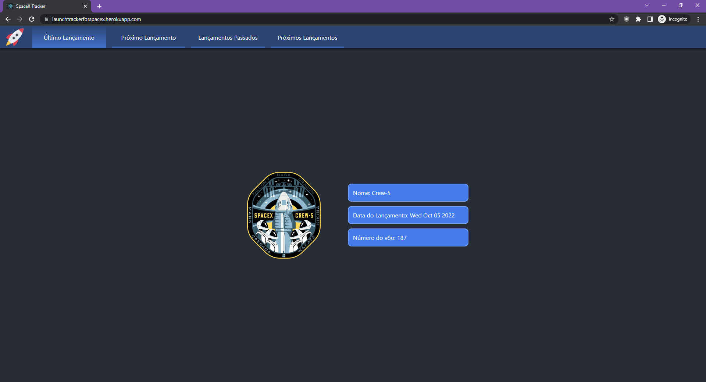
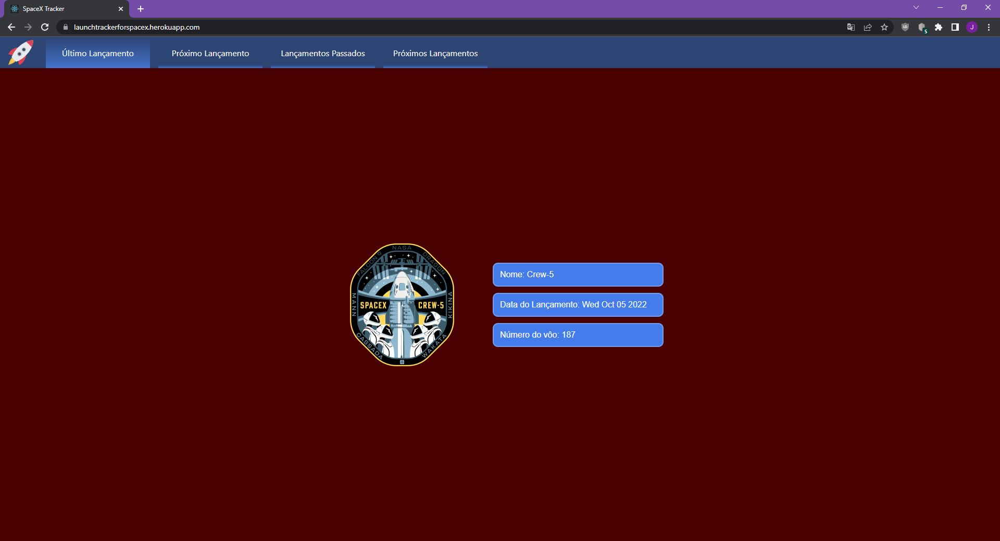

# Desafio - Lançamentos SpaceX
### Descrição
Este projeto tem um backend Node para consumir os dados da API da SpaceX e serví-los em sua própria API, e um frontend React que consome a API do backend e mostra as informações para o usuário.

### Instruções de uso
- Faça o download/clone o repositório
- Execute as seguintes linhas no prompt de comando na pasta "backend" e depois na pasta "frontend"
  - `npm i`
  - `npm start`
- Em cada prompt, deverão aparecer mensagens dizendo que as aplicações estão rodando. Acesse o link disponível no prompt do frontend para utilizar a aplicação

### Testes
O frontend e o backend contam com arquivos de teste. Para rodá-los, use o comando `npm test` na raíz de cada pasta.

Os testes de backend dependem da disponibilidade da API da SpaceX. Caso a API não esteja disponível, eles vão falhar.

Alguns testes de frontend dependem da conexão com o backend, e da disponibilidade da API da SpaceX. Caso o servidor não esteja rodando e/ou a API da SpaceX não esteja disponível, eles vão falhar.

### Informações Adicionais
Este projeto está disponível no Heroku no seguinte link: https://launchtrackerforspacex.herokuapp.com/

Como o Heroku desativa as instâncias depois de um tempo sem acesso, o primeiro acesso pode demorar um pouco até que a aplicação esteja disponível novamente.

A aplicação utiliza o Google Optimization para testes A/B. Existem duas variações disponíveis: original (fundo azul escuro) e variante 1 (fundo vinho). E também utiliza o Hotjar para criar um heatmap.

Desligue seu adblock/antitracker antes de acessar a aplicação.

### Original

### Variante 1

